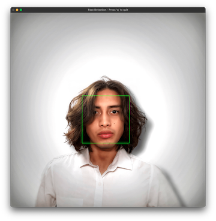
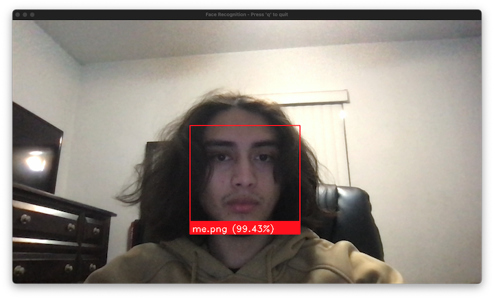
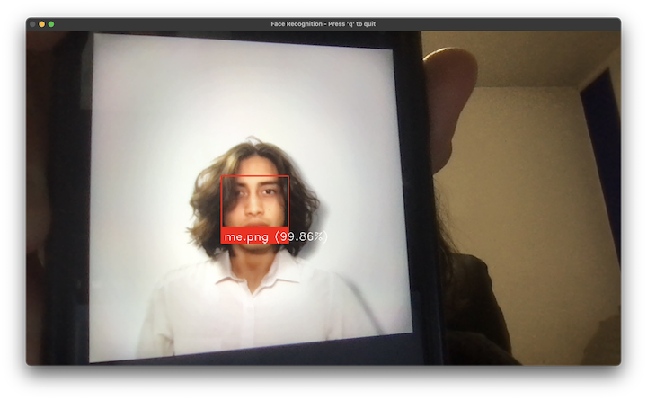

# Face-Detection-Recognition
## This repository contains multiple python scripts that use AI/deep learning for face detection and recognition.

### File 1 : faceDetection.py - face detection on loaded image
How to run : open file and run on IDE that supports python

How to quit : press 'q' on pop-up frame to close window and exit program

How it works : 
1. Loads 1 image from a specified directory
2. Converts image to grayscale  
3. Uses haar cascades algorithm to detect faces
4. Window will open with frame around the face detected

The script uses **openCV** and the **haarcascade** algorithm

Issues you might encounter : 
- If the image file is corrupted or not in the correct format, the program will be unable to read it
- Even if the file extension is correct, the image itself might not be valid. You might need to convert it again (try : https://bit.ly/3WI2FPP)

### File 2 : faceRecognition.py - real time face recognition
How to run : open file and run on IDE that supports python

How to quit : press 'q' on live webcam window to close window and exit program

How it works : 
1. Loads images from a specified directory
2. Encodes images from step 1
3. Opens webcam and encodes the current live feed
4. Checks if there is a match between the encoded images and the live frames encoded

The script uses **openCV** and the **face_recognition** api 

